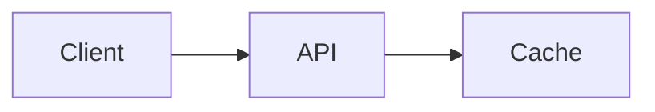

# 🚀 <Project Name>

Short description (1–2 lines).
Example:
Demonstrates how backend load impacts user-perceived latency using Time-To-Visible (TTV).

---

## 🧠 What This Shows

- Key concept 1
- Key concept 2
- Key concept 3

---

## 🏗️ Architecture

